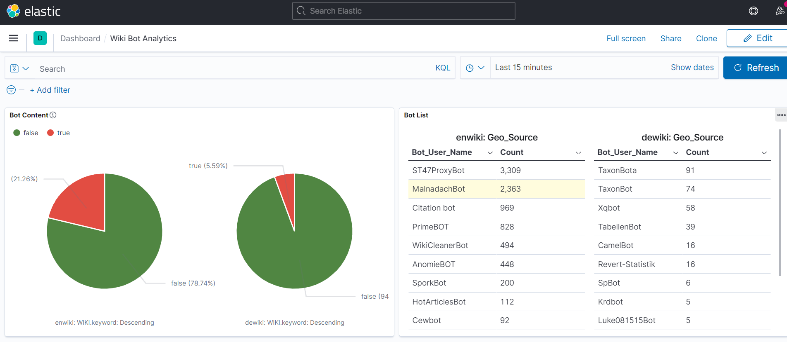
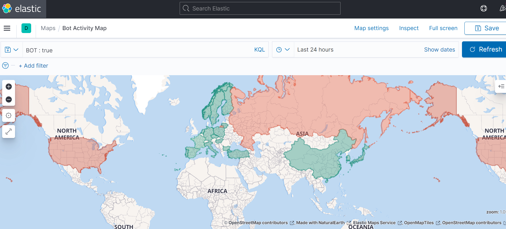
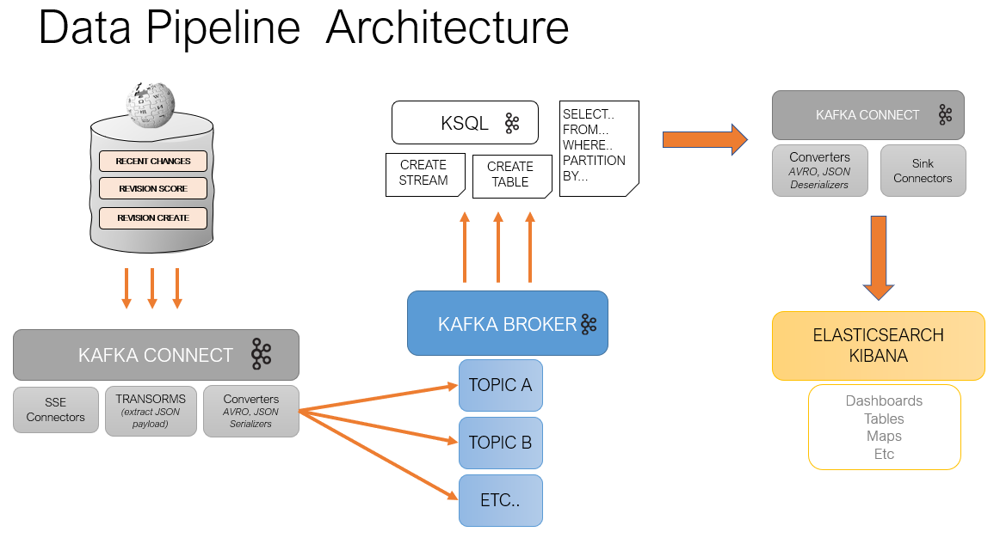
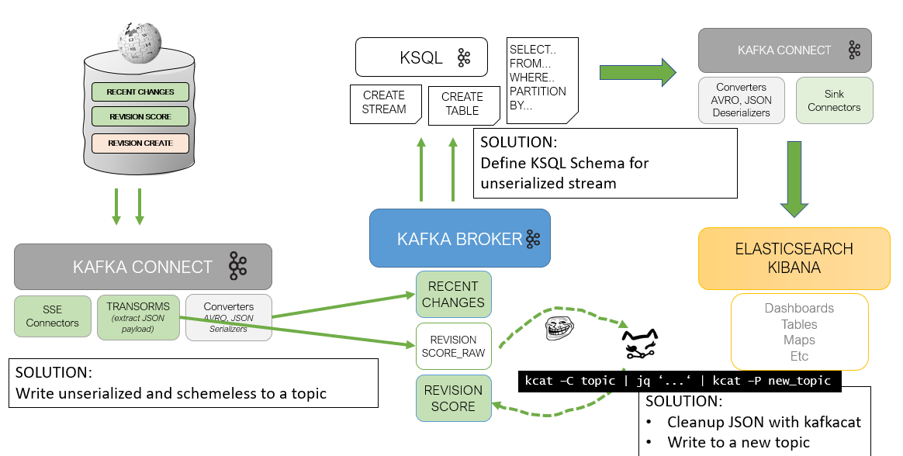

# Wikipedia Event Streaming and Real-Time Analytics with Kafka + ElasticStack

## Purpose
Use the MediaWiki Event Stream API to run real-time analyitcs using Kafka + Elastic Stack.

## Description
Track bot acitity created content on Wikipedia in real-time.
Utilizig ORES ML services, track how Wikipedia tracks potential of quality damaging edits to existing artictles. Attemt to identify topics and domains that are mostly susceptible.
Wikipedia implements a real-time ML revision algo to understand if changes are damaging or goodfaith.
This real-time data could be used to create a service that reports on: 
* Share of damaging vs. non-damaging content
* Language locales where damaging content is the highest
* Topics that are prone to falsehood from the outside world
* etc...
  https://www.mediawiki.org/wiki/ORES/sv

## Output
Dashboard with real-time updates of events on Wikipedia.




## Start
After cloning, the application is a `docker-compose` and can be initialized simply with `docker-compose up -d`. The below information describes in detail the single steps taken to build the pipeline. The application essentially sources event data, process them in real-time and pushes out to ElasticSearch. The index is created rather seamlessly thanks to structured data coming out of Kafka. 

The data folder contains ElasticSearch + Kibana precomputed indicies and visuals that can be fed with new events.

The *requirements file* is not necessary but contains an optional package `sample` for test streaming things on the command line. This helps with understanding the data and do some analysis.

A single `start.sh` script to ran as one-liner is to be added in the next step.

## Sources
Wikimedia Data Stream
https://stream.wikimedia.org/?doc#/streams


## Stack
* Streaming --> Kafka (TBD Kinesis)
* Scripting --> Bash, Kafkacat
* Reproducability --> Docker
  
For data injection on the fly (TBD):
* Cloud --> AWS Lambda, Azure Functions
...


## Pipeline & Data per Endpoint



### MediaWiki Endpoints
<p>Page Events: Create, Move, Delete, Link Change, Recent Change<p>
<p>Revision Events: Create, Score<p><br>


**Recentchange**:
https://stream.wikimedia.org//v2/stream/recentchange 
* Title
* URL
* Language domain
* timestamp
* user_name
* user_comment (comment reason for change)
* user_is_bot (here called "bot")
* bot_type(located user; not new field!)
* type(edit, categorize etc.) --> unique to end-point
* length (article lenght: old and new) --> unique to end-point
* minor change (if it is a minor change) --> unique to end-point

*Sample JSON*
```
"$schema":"/mediawiki/recentchange/1.0.0",
   "meta":{
      "uri":"https://commons.wikimedia.org/wiki/File:DESERT_SCIMITAR_130430-M-OC922-009.jpg",
      "request_id":"1b12bec3-c72e-4451-ae23-bc5742c51343",
      "id":"e195ebcf-e9ff-4179-9591-0d2384b96117",
      "dt":"2021-08-27T13:20:18Z",
      "domain":"commons.wikimedia.org",
      "stream":"mediawiki.recentchange",
      "topic":"codfw.mediawiki.recentchange",
      "partition":0,
      "offset":441362978
   },
   "id":1754327016,
   "type":"edit",
   "namespace":6,
   "title":"File:DESERT SCIMITAR 130430-M-OC922-009.jpg",
   "comment":"add location United States inside Taken On on template",
   "timestamp":1630070418,
   "user":"RudolphousBot",
   "bot":true,
   "minor":true,
   "patrolled":true,
   "length":{
      "old":1132,
      "new":1155
   },
   "revision":{
      "old":585514253,
      "new":586543834
   },
   "server_url":"https://commons.wikimedia.org",
   "server_name":"commons.wikimedia.org",
   "server_script_path":"/w",
   "wiki":"commonswiki",
   "parsedcomment":"add location United States inside Taken On on template"
```

**Revision Create**:
https://stream.wikimedia.org//v2/stream/revision-create 
* Title, URL, Lang Domain, timestamp, user_name, user_is_bot, bot_type(located in user_text), user_comment <-- common with Recent Change
* user_group(bot,editor, others)
* user_registration_date
* user_edit_count
* rev_content_changed (if content has been chaned during the revision by the user) --> unique to end-point

*Sample JSON*
```
{
   "$schema":"/mediawiki/revision/create/1.1.0",
   "meta":{
      "uri":"https://meta.wikimedia.org/wiki/MediaWiki:Centralnotice-Election2021_Board_voting_starts_new_new-vote/ba",
      "request_id":"18d52d9e-f74a-4076-b5b0-a8679025099d",
      "id":"d2b4b215-5158-4bb0-aa28-365b6bf94ad4",
      "dt":"2021-08-27T11:49:49Z",
      "domain":"meta.wikimedia.org",
      "stream":"mediawiki.revision-create",
      "topic":"codfw.mediawiki.revision-create",
      "partition":0,
      "offset":269740393
   },
   "database":"metawiki",
   "page_id":11490274,
   "page_title":"MediaWiki:Centralnotice-Election2021_Board_voting_starts_new_new-vote/ba",
   "page_namespace":8,
   "rev_id":21941944,
   "rev_timestamp":"2021-08-27T11:49:48Z",
   "rev_sha1":"6fcwahwaz8kd7flbxurwyzbvbcw4kmr",
   "rev_minor_edit":true,
   "rev_len":21,
   "rev_content_model":"wikitext",
   "rev_content_format":"text/x-wiki",
   "performer":{
      "user_text":"DerHexer",
      "user_groups":[
         "centralnoticeadmin",
         "oauthadmin",
         "oversight",
         "steward",
         "sysop",
         "translationadmin",
         "*",
         "user",
         "autoconfirmed"
      ],
      "user_is_bot":false,
      "user_id":33668,
      "user_registration_dt":"2006-10-14T10:36:59Z",
      "user_edit_count":7790
   },
   "page_is_redirect":false,
   "comment":"Protected \"[[MediaWiki:Centralnotice-Election2021 Board voting starts new new-vote/ba]]\": Automatically protected by CentralNotice; please edit only via [[Special:CentralNotice]] or [[Special:Translate]] ([Edit=Allow only central notice administrators] (indefinite) [Move=Allow only central notice administrators] (indefinite)) [cascading]",
   "parsedcomment":"Protected &quot;<a href=\"/wiki/MediaWiki:Centralnotice-Election2021_Board_voting_starts_new_new-vote/ba\" title=\"MediaWiki:Centralnotice-Election2021 Board voting starts new new-vote/ba\">MediaWiki:Centralnotice-Election2021 Board voting starts new new-vote/ba</a>&quot;: Automatically protected by CentralNotice; please edit only via <a href=\"/wiki/Special:CentralNotice\" title=\"Special:CentralNotice\">Special:CentralNotice</a> or <a href=\"/wiki/Special:Translate\" title=\"Special:Translate\">Special:Translate</a> ([Edit=Allow only central notice administrators] (indefinite) [Move=Allow only central notice administrators] (indefinite)) [cascading]",
   "rev_parent_id":21941943,
   "rev_content_changed":false
}
```

**Revision Score:** 
https://stream.wikimedia.org//v2/stream/revision-score
* Title, URL, Lang Domain, timestamp, user, user_group(bot,editor), user_is_bot, bot_type(see above), user_edit_count, user_registration_date <-- common with Recent Change & Revision Create
* ML content quality (mostly wikidata): --> unique to end-point
-- damage_score
-- goodfaith_score 
* ML_topic (mostly wikidata): --> unique to end-point
-- Biography
-- Culture
-- Music
-- etc.
* ML draft_topic (sames as item_topic but flagged as draft) --> unique to end-point

*Sample JSON*
```
{
   "$schema":"/mediawiki/revision/score/2.0.0",
   "meta":{
      "stream":"mediawiki.revision-score",
      "uri":"https://it.wikipedia.org/wiki/Sinfonia_n._3",
      "request_id":"2a40b30f-7b24-4ce3-8c50-a39ad21070d1",
      "id":"05727ba0-0736-11ec-a4e8-af04d934395e",
      "dt":"2021-08-27T12:55:14.266Z",
      "domain":"it.wikipedia.org",
      "topic":"codfw.mediawiki.revision-score",
      "partition":0,
      "offset":152777675
   },
   "database":"itwiki",
   "page_id":3160677,
   "page_title":"Sinfonia_n._3",
   "page_namespace":0,
   "page_is_redirect":false,
   "performer":{
      "user_text":"ValterVB",
      "user_groups":[
         "sysop",
         "*",
         "user",
         "autoconfirmed"
      ],
      "user_is_bot":false,
      "user_id":697352,
      "user_registration_dt":"2011-12-10T18:13:32Z",
      "user_edit_count":76119
   },
   "rev_id":122707501,
   "rev_parent_id":122046357,
   "rev_timestamp":"2021-08-27T12:55:10Z",
   "scores":{
      "damaging":{
         "model_name":"damaging",
         "model_version":"0.5.0",
         "prediction":[
            "false"
         ],
         "probability":{
            "false":0.9880401000905714,
            "true":0.011959899909428638
         }
      },
      "goodfaith":{
         "model_name":"goodfaith",
         "model_version":"0.5.0",
         "prediction":[
            "true"
         ],
         "probability":{
            "false":0.009194563774685416,
            "true":0.9908054362253146
         }
      }
   }
}
```


<br>*(NOT USEFUL FOR NOW - events not happening often)*

**Page Delete** --> Events are more rare and used also for renaming pages
* User name
* timestamp
* comment (reason for deletion)

**Page Create:**  --> Events are more more rare than changes to existing articles
* User
* Timestamp
* comment
* Title
* URI
* Lang Domain
* user_is_bot
* user_edit_count
	
**Domains:** 
Wikipedia, Wikidata, Wikisource, Wikimedia


### DATA SCOPE DEFINITION
---

**Dimensions Inclusion:**

* Title
* URL
* Language domain
* change_timestamp
* user_name
* user_comment (RCH, RVCR)
* user_is_bot
* change_type (RCH)
* lenght (RCH)
* user_registration_date (RVCR, RSC)
* user_edit_count (RVCR, RSC)
* rev_content_changed (RVCR)
* ML content quality: damage, goodfaith (RSC)


### Observation
---

* Matches between endpoints on entry changes but not all
* Revision Create (RSC) and Recentchange share the timestamp
* "request_id" can be used for matching


### Wikipedia EventStreams Architecture
---
Wikimedia is using Kafka under the hood with a custom build KafkaSSE connector by the Wikipedia.org team. The SSE client is connected to internal Kafka consumers and exposed via HTTP to external clients. More information on Wikimedia EventStreams architecture can be found [here](https://wikitech.wikimedia.org/wiki/Event_Platform/EventStreams).

Kafka Connect is using a custom SSE connector ([kudos cjmatta](https://github.com/cjmatta/kafka-connect-sse)) to stream data into the cluster.

<br>


### Kafka Connect

* Connector: Custom SSE Connector
* Converter: (AVRO) Serialization Handlers (writes into key value(bytes))
* Schema: "Contract" between (data)services
* Transforms: extracting payload from "data" field (also used in config format)


Schema Compatibility needs to be (likely) FUll. Check what it is currently:
```
curl -s localhost:8081/config
```
If not FULL, then change:
```
curl -X PUT -H "application/json" -s localhost:8081/config --data '{"compatibilityLevel": "FULL"}'
```

### Test Incoming topics

Make checks if topics are ariving via a kafka-console-consumer.
`kafka-console-consumer --topic wiki_recentchange --bootstrap-server broker:29092 --max-messages 10 --from-beginning`

Or testing via a file sync by adding *file_output_connector* and viewing file with real-time changes.

`tail -n kafka/data/file_consumer/test.sink.txt`


### Transform Revision Score Endpoint

Although though for the endpoint the schema has been also provided like for *recentchange*, after many attempts of parsing JSON with existing transforms yielded no results. The content of the "scores" field, which contains information on Wikipedia's intent classification is *open content* JSON and has no fixed schema noted with "additionalParameter" in the master schema. The solution is to transform the incoming messages with kafkacat and define a seperate schema. By doing that, this will enforce a fixed structure on the incoming messages. The connector used for getting data is SSE with with a value converter of string before passing to kafkacat and doing the cleanup with jq.



Routing from Kafkacat to another topic with a schema.

```
kafkacat -C -b localhost:9092 -t wiki_revisionscore_raw -u | jq -c 'select(.meta.domain == "en.wikipedia.org") | {uri: .meta.uri, domain: .meta.domain, id: .meta.id, request_id: .meta.request_id, wiki: .database, page_id: .page_id, page_title: .page_title, bot: .performer.user_is_bot, user_id: .performer.user_id, user_registration_date: .performer.user_registration_dt, user_edit_count: .performer.user_edit_count, damaging_intent: .scores.damaging, goodfaith_intent: .scores.goodfaith}' | kafkacat -P -b localhost:9092 -t wiki_revisionscore
```

Consolue consumer is the solution to pipe to jq and apply serialization in a new topic. This is a test.

```
kafka-console-consumer --topic wiki_revisionscore_raw --bootstrap-server broker:29092 | jq -c 'select(.meta.domain == "en.wikipedia.org") | {uri: .meta.uri, domain: .meta.domain}' |kafka-avro-console-producer --bootstrap-server broker:29092 --property schema.registry.url=http://schema-registry:8081 --topic wiki_revisionscore_testing --property value.schema='{"name": "revisionscore", "namespace": "mediawiki", "type": "record", "fields": [{"name": "uri", "type": "string"}, {"name": "domain", "type": "string"}]}'
```

Install jq
login as root `docker exec -it -u root kafka-connect-container /bin/bash`

download jq binary into bin and make executable `curl -s -L https://github.com/stedolan/jq/releases/download/jq-1.6/jq-linux64 > bin/jq && chmod a+x bin/jq`

Run the command below

INTERIM
Status: Int values are throwing errors on EXPECTED_TYPE and receive a different one.
The fields that need correct schema defintion are **user_registration_dt**, **user_id**, **user_edit_count**
https://issues.apache.org/jira/browse/AVRO-1582

```
kafka-console-consumer --topic wiki_revisionscore_raw --bootstrap-server broker:29092 | jq -c 'select(.meta.domain == "en.wikipedia.org") | {uri: .meta.uri, domain: .meta.domain, id: .meta.id, request_id: .meta.request_id, wiki: .database, page_id: .page_id, page_title: .page_title, bot: .performer.user_is_bot, user_registration_date: .performer.user_registration_dt}' | kafka-avro-console-producer --bootstrap-server broker:29092 --property schema.registry.url=http://schema-registry:8081 --topic wiki_revisionscore_testing --property value.schema='{"name": "revisionscore", "namespace": "mediawiki", "type": "record", "fields": [{"name": "uri", "type": "string"}, {"name": "domain", "type": "string"},{"name":"id","type":"string"},{"name":"request_id","type":"string"},{"name":"wiki","type":"string"},{"name":"page_id","type":"int"},{"name":"page_title","type":"string"},{"name":"bot","type":"boolean"},{"name":"user_registration_date","type":"long","logicalType":"timestamp-millis"}]}'
```

```
kafka-console-consumer --topic wiki_revisionscore_raw --bootstrap-server broker:29092 | jq -c 'select(.meta.domain == "en.wikipedia.org") | {uri: .meta.uri, user_registration_date: .performer.user_registration_dt}' | kafka-avro-console-producer --bootstrap-server broker:29092 --property schema.registry.url=http://schema-registry:8081 --topic wiki_revisionscore_testing --property value.schema='{"name": "revisionscore", "namespace": "mediawiki", "type": "record", "fields": [{"name": "uri", "type": "string"}, {"default": null, "name": "user_registration_date", "type":["null", {"type": "string", "logicalType":"timestamp-millis"}]}]}'
```


FINAL but needs to be fixed when above is fixed

```
kafka-console-consumer --topic wiki_revisionscore_raw --bootstrap-server broker:29092 | jq -c 'select(.meta.domain == "en.wikipedia.org") | {uri: .meta.uri, domain: .meta.domain, id: .meta.id, request_id: .meta.request_id, wiki: .database, page_id: .page_id, page_title: .page_title, bot: .performer.user_is_bot, user_id: .performer.user_id, user_registration_date: .performer.user_registration_dt, user_edit_count: .performer.user_edit_count, damaging_intent: .scores.damaging, goodfaith_intent: .scores.goodfaith}' | kafka-avro-console-producer --bootstrap-server broker:29092 --property schema.registry.url=http://schema-registry:8081 --topic wiki_revisionscore --property value.schema='{"name":"revisionscore","type":"record","namespace":"mediawiki","fields":[{"name":"uri","type":"string"},{"name":"domain","type":"string"},{"name":"id","type":"string"},{"name":"request_id","type":"string"},{"name":"wiki","type":"string"},{"name":"page_id","type":"int"},{"name":"page_title","type":"string"},{"name":"bot","type":"boolean"},{"name":"user_id","type":"int"},{"name":"user_registration_date","type":"int","logicalType":"date"},{"name":"user_edit_count","type":"int"},{"name":"damaging_intent","type":{"name":"damaging_intent",	"namespace":"damaging_properties","type":"record","fields":[{"name":"model_name","type":"string"},{"name":"model_version","type":"string"},{"name":"prediction","type":{"type":"array","items":"string"}},{"name":"probability","type":{"name":"probability","type":"record","fields":[{"name":"false","type":"float"},{"name":"true","type":"float"}]}}]}},{"name":"goodfaith_intent","type":{"name":"goodfaith_intent",	"namespace":"goodfaith_properties","type":"record","fields":[{"name":"model_name","type":"string"},{"name":"model_version","type":"string"},{"name":"prediction","type":{"type":"array","items":"string"}},{"name":"probability","type":{"name":"probability","type":"record","fields":[{"name":"false","type":"float"},{"name":"true","type":"float"}]}}]}}]}'
```

BELOW NOT WORKING

Attempting with console-consumer and JSON schma from mediawiki repo. This gets everything going but does not let KSQL handle "additionalProperties" correctly.

```
kafka-console-consumer --topic wiki_revisionscore_raw --bootstrap-server broker:29092 | kafka-json-schema-console-producer --bootstrap-server broker:29092 --property schema.registry.url=http://schema-registry:8081 --topic wiki_revisionscore --property value.schema=$(curl -s https://raw.githubusercontent.com/wikimedia/mediawiki-event-schemas/master/jsonschema/mediawiki/revision/score/2.0.0.json | tr -d "\n" | tr -d " ")
```

### TRANSFORM with KSQL

Setup a querable stream for both endpoints. The stream definition automatically overtakes all fields in the schema.

```
CREATE STREAM recentchange
   WITH (
      KAFKA_TOPIC='wiki_recentchange',
      VALUE_FORMAT ='AVRO'
);

CREATE STREAM revisionscore
   WITH (
      KAFKA_TOPIC='wiki_revisionscore',
      VALUE_FORMAT='AVRO'
   );
```

Setup revision score query:

```
CREATE STREAM revisionscore_all(
	uri VARCHAR,
	domain VARCHAR,
	id VARCHAR,
	request_id VARCHAR,
	wiki VARCHAR,
	page_id int,
	page_title VARCHAR,
	bot BOOLEAN,
	user_id int,
	user_registration_date TIMESTAMP,
	user_edit_count int,
	damaging_intent STRUCT<model_name VARCHAR,
		prediction ARRAY,
		probability STRUCT<
			'true' DOUBLE,
			'false' DOUBLE>
		>,
	goodfaith_intent STRUCT<model_name VARCHAR,
		prediction ARRAY,
		probability STRUCT<
			'true' DOUBLE,
			'false' DOUBLE>
		>)
WITH (
	KAFKA_TOPIC='wiki_revisionscore',
	VALUE_FORMAT='JSON');

CREATE STREAM change_intent AS 
SELECT  
	wiki,
	page_title,
    bot,
    CASE WHEN damaging_intent->prediction = '[true]' THEN 'Damaging'
    	WHEN goodfaith_intent->prediction = '[true]' THEN 'Goodfaith'
    ELSE null
    END as Intent
FROM  REVISIONSCORE_ALL_1 EMIT CHANGES;
```


Setup a cleaned stream for only DE and EN Wiki entries. This will be used for the "Wiki Bot Analytics" Dashboard.

```
CREATE STREAM recentchange_en_de
   WITH (
      TIMESTAMP = 'timestamp'
)
AS SELECT
   meta->id as meta_id,
   meta->request_id as meta_request_id,
   meta->uri as URI,
   meta->dt as meta_timestamp,
   meta->domain as meta_domain,
   id,
   user,
   type,
   bot,
   title,
   comment,
   timestamp,
   minor,
   patrolled,
   length->old as lenght_old,
   length->new as length_new,
   revision->old as revision_old,
   revision->new as revision_new,
   server_url,
   server_name,
   wiki
FROM  RECENTCHANGE 
WHERE server_name = 'en.wikipedia.org' OR server_name = 'de.wikipedia.org'
EMIT CHANGES;
```

Setup a stream for geo regions according to 'ISO 3166-1 alpha-2'. It is not possible to map countries to languages and hence the map visualisation does not make a lot of sense. Nevertheless, some countires were mapped for demo purposes to provide insights ('en' is mapped to 'US' - sorry UK):
```
CREATE STREAM recentchange_geo
   WITH (
      TIMESTAMP = 'timestamp'
)
AS SELECT
   meta->id as meta_id,
   meta->request_id as meta_request_id,
   meta->uri as URI,
   meta->dt as meta_timestamp,
   meta->domain as meta_domain,
   id,
   user,
   type,
   bot,
   title,
   comment,
   timestamp,
   minor,
   patrolled,
   length->old as lenght_old,
   length->new as length_new,
   revision->old as revision_old,
   revision->new as revision_new,
   server_url,
   server_name,
   CASE WHEN UCASE(SUBSTRING(wiki,1,2)) like 'EN' THEN 'US'
   	WHEN UCASE(SUBSTRING(wiki,1,2)) like 'KY' THEN 'KG'
      WHEN UCASE(SUBSTRING(wiki,1,2)) like 'JA' THEN 'JP'
      WHEN UCASE(SUBSTRING(wiki,1,2)) like 'VI' THEN 'VN'
      WHEN UCASE(SUBSTRING(wiki,1,2)) like 'KO' THEN 'KR'
      WHEN UCASE(SUBSTRING(wiki,1,2)) like 'ZH' THEN 'CN'
      WHEN UCASE(SUBSTRING(wiki,1,2)) like 'SV' THEN 'SE'
      WHEN UCASE(SUBSTRING(wiki,1,2)) like 'ET' THEN 'EE'
      WHEN UCASE(SUBSTRING(wiki,1,2)) like 'CS' THEN 'CZ'
      WHEN UCASE(SUBSTRING(wiki,1,2)) like 'DA' THEN 'DK'
   	ELSE UCASE(SUBSTRING(wiki,1,2))
    END
   	as geo
FROM  RECENTCHANGE
WHERE server_name NOT IN ('www.wikidata.org', 'commons.wikimedia.org', 'wikimania.wikimedia.org')
   AND SUBSTRING(wiki,1,2) IN ('de', 'en', 'ru', 'fr', 'it', 'es', 'pt', 'fi', 'lt', 'nl', 'hu', 'pl', 'ky', 'ja', 'vi', 'th', 'tr', 'ko', 'zh', 'sv', 'no', 'lv', 'et', 'cs', 'ro', 'bg', 'sk', 'da')
EMIT CHANGES;
```


**More stuff, improvements and data enrichment is coming up**